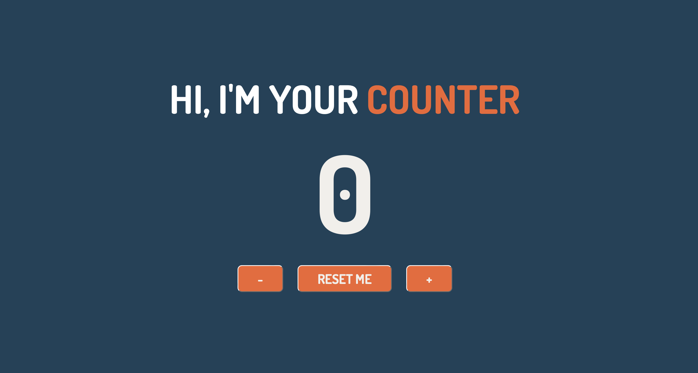

<h1 align="center">👩🏻‍💻 Javascript Basics Project</h1>
<h3 align="center">Developing a JavaScript application that allows the user to increase and decrease the value of the counter.</h3>
<h4 align="center">https://63d8f281fb0a6e6ffb5b747c--exquisite-chebakia-52e0c4.netlify.app</h4>
 

*Read this in other languages: [Italian](README.md).*

The user, upon entering the page, will see "0" as the value of the counter. 
   
  They will have three buttons available: 
    • +/- to change the value of the counter 
    • and one to reset its value.

   

  

<h4>Webhost utilizzato: https://www.netlify.com</h4>
