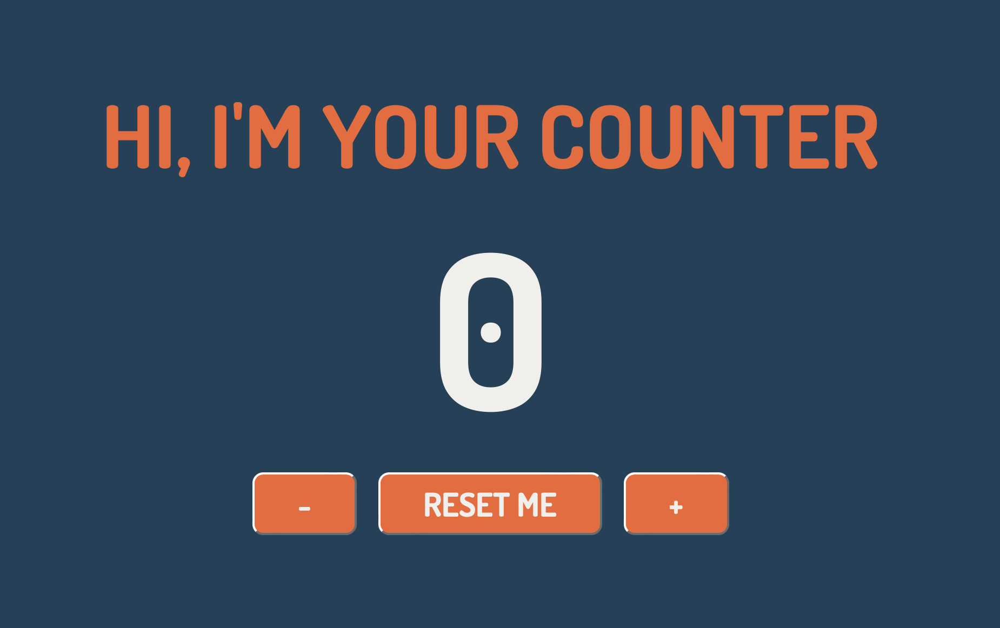

<h1 align="center">Progetto Javascript Basics di Cristina Ghinghiloschi</h1>
<h3 align="center">Sviluppo un'applicazione JavaScript che permette all'utente di aumentare e decrementare il valore del counter.</h3>
<h4 align="center">https://63d8f281fb0a6e6ffb5b747c--exquisite-chebakia-52e0c4.netlify.app</h4>
 

L'utente, appena entrato nella pagina, visualizzerà "0" come valore del counter. 
   
  Avrà a disposizione tre pulsanti: 
    • +/- per cambiare il valore del counter 
    • e uno per resettarne il valore.

   

  

<h4>Webhost utilizzato: https://www.netlify.com</h4>
